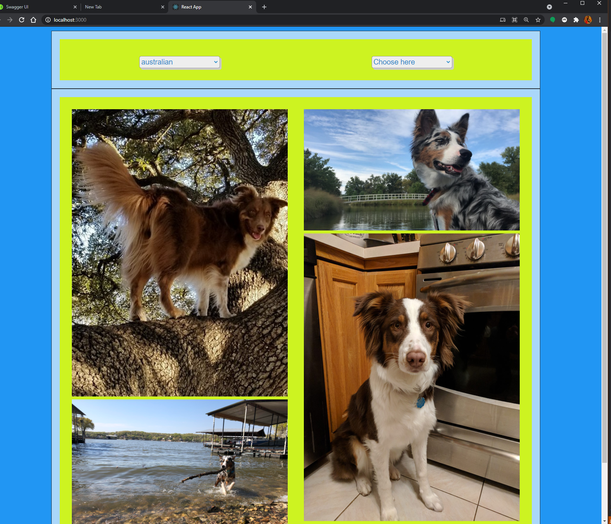
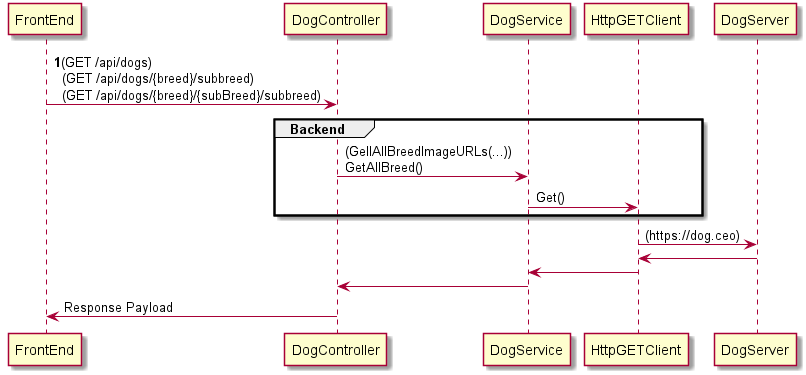
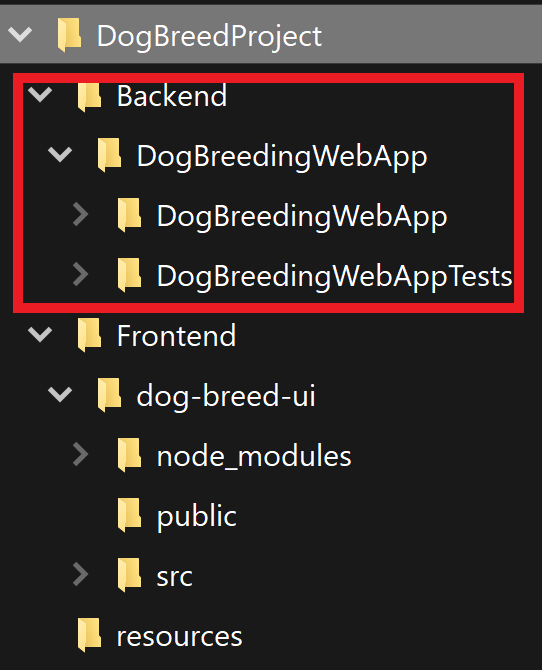
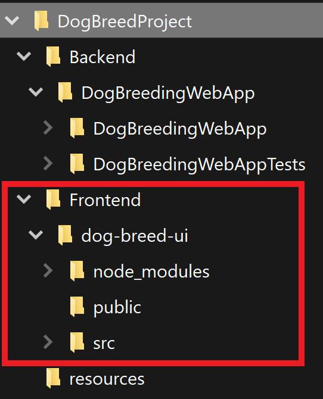
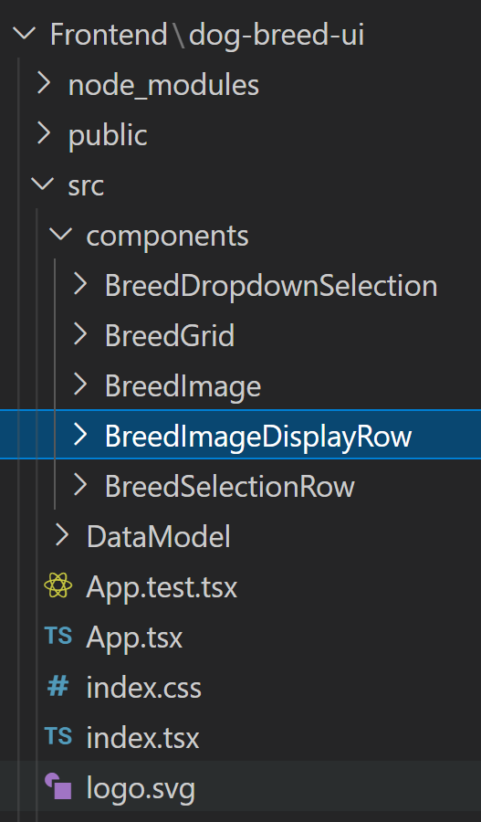

# README.md
## DogBreedProject

* This code base consists of frontend and backend implementation.
### Running the code

* After cloning and checking out the repository to `develop` branch, you can enter into `Backend/DogBreedingWebApp` to build the C# source code.
* You can open the solution in VS2019.
* Alternatively, you can go to the above mentioned location and execute the following command to build the backend implementation. `dotnet clean;dotnet build`
* To run the backend, you can open this solution in VS2019 and click the play button.
* Upon running the backend, SwaggerUI will open up in your browser and you can use SwaggerUI to do manual calls to the API

* For frontend, you would have to go to `Frontend/dog-breed-ui` and execute the following command: `yarn install` then `yarn start`. `yarn install` will setup the react project for you will its dependencies. `yarn start` will run the project and this will open a new page in the browser, as shown below.

### Backend

#### Api calls

* 3 api calls are used to to retrieve data from the external source. Below is the sequence digram presented where labelled `1` at FrontEnd Layer shows the apis call the frontend make.

* Following is the Backend source organisation to have a brief overview of the source code structure.

### Frontend

* React is used for frontend development.
* `yarn` command is used instead of `npm`
* Below highlights where the source code for frontend resides.

* Below is the next granular level that displays where the components of the frontend sits.
* focusing on the components folder, The `BreedGrid` holds all the other child components togther.
* `BreedGrid` component holders `BreedSelectionRow` and `BreedImageDisplayRow`
* `BreedSelectionRow` will have `BreedDropdownSelection` component. 
* `BreedImageDisplayRow` will have `BreedImage` component.

* The `App.tsx` will only have `BreedGrid` as a whole.

* The error message nad loading indication happens in the `BreedGrid` component
* All the api request to the backend happens in the `BreedGrid` component. 
* `BreedGrid` component is the component responsible to distribute the breed list down to children components after receiving the response from the Api calls.
 

### Overall

* This is a good project for learning experience and to have a good hands-on with React.
* I've learnt a lot from this challenge, main in React as frontend framework.
* I would like to definitely improve this project in my own time.

### Areas I would to improve on this project
* Adding Docker for Azure Container Registry.
* Better CSS styling for frontend.
* This project is currently developed in Typescript. I would like to try React's Hooks for this requirements.
* I missed out on Frontend testing, I would like to add in Frontend testing framework (`React Testing Library`)
* This is also a good candidate for automation testing.
* Today, the image urls are used by frontend to load up the images. I would like to review this for quick image load up.
* Improve Swagger documentation.
* Image editing feature can be a good story to work on to further develop this project.
